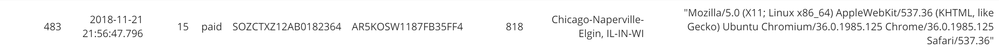

## Concept
For this project I am working for the startup company, Sparkify. They have been collecting data on songs and user acivity with their new music streaming app. They currently dont have a good method to query the data they need which resides in JSON logs and metadata for user activity and songs. This will help them understand what songs users are listening to. 

This is where I come in as a data engineer. My task is to create a Postgres database with tables designed to optimize queries on song play analysis. 

In this repository I have created a database schema and ETL pipeline using python for analysis. 

## Content
- The Data
- Creating Tables With Postgresql
- Building the ETL pipeline
- Quality Check
- Run

## The Data
The first dataset is a subset of real data from the Million Song Dataset. Each file is in JSON format and contains metadata about a song and the artist of that song. The files are partitioned by the first three letters of each song's track ID. For example, here are filepaths to two files in this dataset.

        song_data/A/B/C/TRABCEI128F424C983.json
        song_data/A/A/B/TRAABJL12903CDCF1A.json
        
And below is an example of what a single song file, TRAABJL12903CDCF1A.json, looks like.

        {"num_songs": 1, "artist_id": "ARJIE2Y1187B994AB7", "artist_latitude": null, "artist_longitude": null, "artist_location": "", "artist_name": "Line Renaud", "song_id": "SOUPIRU12A6D4FA1E1", "title": "Der Kleine Dompfaff", "duration": 152.92036, "year": 0}
        
The second dataset consists of log files in JSON format generated by an event simulator based on the songs in the dataset above. These simulate activity logs from a music streaming app based on specified configurations.

The log files in the dataset I'll be working with are partitioned by year and month. For example, here are filepaths to two files in this dataset.

        log_data/2018/11/2018-11-12-events.json
        log_data/2018/11/2018-11-13-events.json

## Creating Tables With Postgresql
This was the first and most important step because where are we going to store the data we need without tables?

The file sql_queries.py is where we establish the database schema design. This schema is a star schema, the simplest style of data mart schema which consists of the table *songplays referencing* the tables *songs*, *artists*, *users* and *time*. 

Each table in the schema has a *PRIMARY KEY* and *NOT NULL* so that we have good data integrity. For each table I chose these values to be the row identifier simply because we do not want these values to be repeated under the same column. for example:

        songplay_table_create = ("""CREATE TABLE IF NOT EXISTS songplays \
                            (songplay_id serial PRIMARY KEY, \
                            start_time varchar, \
                            user_id int NOT NULL, \
                            level varchar, \
                            song_id varchar NOT NULL, \
                            artist_id varchar NOT NULL, \
                            session_id int, \
                            location varchar, \
                            user_agent varchar);

What if in the off chance two users have the same first and last name. we want to be able to uniquley identify them by their user identifier in order to tell them apart. The same reasoning can be applied to songs with the same title we want to be able to identify the song and not have a repeat of the same values. These values are also the primary key for the purposes of looking them up in search queries. 

## Building The ETL pipeline
For the fastest speed of the transfer of data, my goal was to code the ETL with the least amount of code as possible. In order to achieve this code I used the pandas module with its easy to use and flexible functions.

This allowed me to implement one line codes to perform data grabs from the JSON files and transfer them to the database efficiently. 

        song_data =  df[['song_id', 'title','artist_id', 'year', 'duration']].values[0].tolist()
        cur.execute(song_table_insert, song_data)
            
Before each insert a fuction is called to check for NULL values. We want to ensure that there aren't any NULL values for foreign keys in our tables. For example, on the songplays table we implement the function to check if song_id and artist_id are null. This ensures data integrity.
        
        CREATE FUNCTION songplays_null_checker() RETURNS trigger AS $songplays_null_checker$
        BEGIN
            -- Check that user_id, song_id, and artist_id are given
            IF NEW.song_id IS NULL THEN
                NEW.song_id = 'Does not exist';
            END IF;
            IF NEW.artist_id IS NULL THEN
                NEW.artist_id = 'Does not exist';
            END IF;

            RETURN NEW;
        END;
        $songplays_null_checker$ LANGUAGE plpgsql;

        CREATE TRIGGER songplays_null_checker BEFORE INSERT OR UPDATE ON songplays
        FOR EACH ROW EXECUTE PROCEDURE songplays_null_checker();

The queries I have emplemented (in the above code block: *song_table_insert*) allow for the information to be inserted without duplicates of the Primary Key. 

        song_table_insert = (""" INSERT INTO songs (song_id, title, artist_id, year, duration) VALUES(%s, %s, %s, %s, %s) ON CONFLICT DO NOTHING;
        """)
        
As a part of the business model we want to ensure that users are able to move between free tier and premium/paid tiers which is why we implement the following code on the users table: 

        ...ON CONFLICT (user_id) DO UPDATE SET level = EXCLUDED.level

## Quality Check
As mentioned before, the purpose of this pipeline was to be able to preform analysis on the data we are provided with by users. with the emplemented query: 

        song_select = ("""SELECT song_id, artists.artist_id FROM (songs JOIN artists ON songs.artist_id=artists.artist_id) \
                                                            WHERE songs.title=%s AND artists.name=%s AND songs.duration=%s
        """)

which use the tables songs, artist and the original log file to gather all the information needed for our table songplays, our table used for the analysis. this query along with the for loop:

        for index, row in df.iterrows():
        #for x in range(len(t)):
            # get songid and artistid from song and artist tables
            cur.execute(song_select, (row.song, row.artist, row.length))
            results = cur.fetchone()

            if results:
                songid, artistid = results
            else:
                songid, artistid = None, None

            # insert songplay record
            df['artistid'], df['songid'], df['songplay_id'] = artistid, songid, index
            songplay_data =  df[['songplay_id', 'ts', 'userId', 'level', 'songid', 'artistid', 'sessionId', 'location', 'userAgent']].values[x].tolist() 
            cur.execute(songplay_table_insert, songplay_data)
            x=x+1
            
allows us to get outputs sucha as the following:

If we run the test program we can see that all data has been sucessfully be piped with simple queries of each table.

Songplays:

Users:

Songs:

Artist:

Time:

Lets say our team wants to find what songs and artist the user Theodore Harris is listening too:

        SELECT song_id, artist_id 
        FROM songplays 
        WHERE songplays.user_id=(SELECT user_id 
                                 FROM users 
                                 WHERE first_name='Theodore' 
                                 AND last_name='Harris') LIMIT 5;
                                 

        
*The above output shows that the songs he has been listening to do not exist becuase the two datasets were created independently and the songs that are in these logs do not exist in our songs database. There is only one song which is the first song from the first quality check image. However our query works becuase it is giving the proper output.*

## Run
I am running this program on a jupyter lab and should work with all versions (currently May 2020).

In order to successfully run the program You must have all files downloaded.

- download and install latest postgresql
- create user 'student' with password 'student'(or change username and password in create_tables.py, line 12)
- Run Create_tables.py (Drops and creates required tables)
- Run Etl.py (Processes data and pipes to database)
- Run test.py (run to test if data has been inserted correctly)
